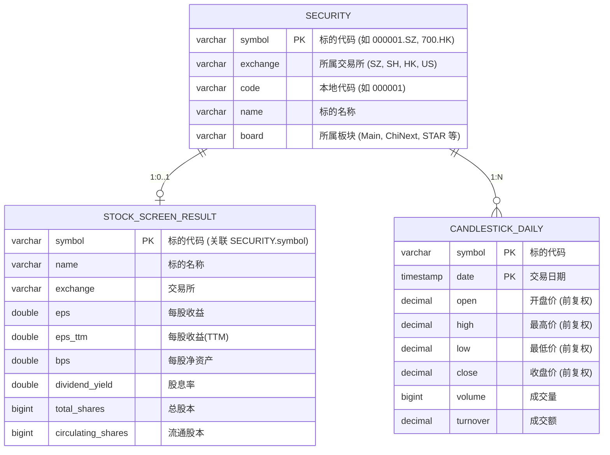

# trade4

trade4 是一个面向多市场（A股、港股、美股）的轻量量化选股与行情分析系统。系统通过统一的标的规约屏蔽不同市场的代码差异，基于长桥 OpenAPI 批量拉取基本面财务指标与历史 K 线行情，并借助 DuckDB 提供高效的本地嵌入式存储与分析能力。

---

## 核心特性

- **多市场标的归一化**：自动抓取并标准化 A股、港股、美股标的代码（统一格式如 `000001.SZ`, `700.HK`, `AAPL.US`）。
- **基本面批量筛选**：基于长桥 OpenAPI 分批（单批次上限 500）获取标的财务指标，支持按每股收益 (EPS)、每股净资产 (BPS)、股息率等多维度进行排序与过滤。
- **行情与技术指标分析**：拉取前复权日 K 线数据，利用 `pandas-ta` 计算均线（MA5、MA20）等常用技术指标。
- **本地高性能分析存储**：集成 DuckDB，支持时序行情与筛选结果的高并发读取和线程安全持久化。
- **全异步高吞吐 I/O**：网络请求全面基于 `httpx` 与 `longbridge` 异步 SDK，配合非阻塞日志系统，保证系统吞吐。

---

## 技术栈

| 层次 | 技术选型 | 说明 |
| :--- | :--- | :--- |
| **运行时与包管理** | Python 3.12+ / `uv` | 基于 PEP 621 规范，依赖统一声明于 `pyproject.toml` |
| **行情与券商接口** | `longbridge` (v5.x) | 长桥官方 OpenAPI 异步 SDK |
| **本地存储** | `duckdb` | 嵌入式分析型列式数据库 |
| **数据与指标** | `pandas`, `pandas-ta` | 行情数据规整与技术指标计算 |
| **异步网络请求** | `httpx` | 市场标的信息抓取 |
| **日志系统** | `loguru` | 异步非阻塞结构化日志 |

---

## 目录结构

```text
trade4/
├── .env.example               # 环境变量配置模板
├── pyproject.toml             # 项目元信息与依赖配置
├── data/                      # 本地数据持久化目录
│   └── trade4.duckdb          # DuckDB 数据库文件
├── logs/                      # 运行日志归档目录
└── src/
    ├── config.py              # 全局配置解析与单例加载
    ├── main.py                # 系统执行入口
    ├── brokers/               # 券商适配层 (长桥 OpenAPI)
    │   └── broker_longbridge.py
    ├── core/                  # 领域契约与通用数据结构 (Protocol / NamedTuple)
    │   ├── broker.py          # 行情与账户接口契约
    │   ├── market.py          # 市场标的同步契约
    │   └── db_ops.py          # 数据库操作契约
    ├── markets/               # 市场特定抓取与同步实现 (CN, HK, US)
    ├── services/              # 业务逻辑服务
    │   ├── duckdb_service.py  # DuckDB 异步服务工厂
    │   ├── quote_service.py   # 选股与行情编排服务
    │   └── trade_service.py   # 交易与账户服务
    └── utils/                 # 工具库 (异步抓取器、计时器、日志)
```

---

## 快速开始

### 1. 安装依赖

推荐使用 [uv](https://github.com/astral-sh/uv) 管理虚拟环境并安装依赖：

```bash
uv sync
```

### 2. 配置环境变量

从示例配置文件创建 `.env`：

```bash
cp .env.example .env
```

在 `.env` 中填入你的长桥 OpenAPI 凭据及本地数据库配置：

```ini
# 长桥 OpenAPI 凭据 (从长桥开发者平台获取)
LONGBRIDGE_APP_KEY=your_app_key
LONGBRIDGE_APP_SECRET=your_app_secret
LONGBRIDGE_ACCESS_TOKEN=your_access_token

# 偏好配置
LONGBRIDGE_REGION=hk
LONGBRIDGE_LANGUAGE=zh-CN

# 本地数据库路径
DB_PATH=data/trade4.duckdb
```

### 3. 运行系统

你可以通过注册好的 CLI 命令或直接运行入口模块启动全流程：

```bash
# 方式 A: 使用 CLI 命令
uv run trade4

# 方式 B: 执行主入口文件
uv run python src/main.py
```

执行后将自动完成：
1. 市场标的同步与 DuckDB `SECURITY` 表更新；
2. 批量拉取标的财务指标，按 EPS 筛选优质股票并写入 `STOCK_SCREEN_RESULT` 表；
3. 获取目标标的的前复权日 K 线数据并输出 MA5 / MA20 指标。

---

## 数据库表结构 (DuckDB)



---

## 扩展与定制

### 自定义选股条件
选股逻辑位于 `src/services/quote_service.py` 中的 `filter_stocks_by_indicators` 方法。可以传入以下参数按需过滤：
- `min_eps`: 最低每股收益
- `min_bps`: 最低每股净资产
- `min_dividend_yield`: 最低股息率
- `top_n`: 返回排序靠前的前 N 只股票

### 新增市场数据源
如需接入新市场（如加密货币或欧洲市场），只需在 `src/markets/` 下实现对应的闭包工厂，返回包含 `spa_stock_info`、`get_trading_hours`、`get_security_list` 的 `Market` 实例，并在 `src/main.py` 中依赖注入即可。
