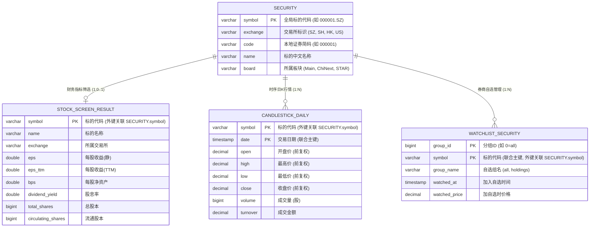

# trade4

trade4 是一个面向多市场（A股、港股、美股）的量化选股与自动化交易系统。系统遵循高内聚低耦合原则，采用分层架构与适配器模式，通过统一的接口规范屏蔽底层券商及数据源差异，依托 DuckDB 提供高性能本地分析与数据存储能力。

---

## 核心设计与技术规范

- **运行环境**: Python 3.12+, 支持 `uv` / `Conda` 隔离环境
- **依赖管理**: 采用 PEP 621 规范，所有生产与开发依赖**唯一收敛至 `pyproject.toml`**。
- **核心依赖**:
  - `longport`: 券商 OpenAPI 适配
  - `duckdb`: 本地嵌入式分析数据库
  - `pandas` / `pandas-ta`: 数据清洗与技术指标计算
  - `python-dotenv`: 环境变量管理
- **架构范式**:
  - **接口契约 (ABC)**: `Broker` 与 `Market` 抽象基类统一能力规范
  - **适配器模式 (Adapter)**: 各券商与市场数据源独立封装，方便热插拔扩展
  - **依赖注入 (DI)**: 业务服务层 (`QuoteService`, `TradeService`) 解耦具体基础设施
  - **单例模式 (Singleton)**: 配置与底层会话全局唯一管理
- **编码准则**:
  - 遵循 Zen of Python 与 PEP 8/257 规范，采用全量类型注解与中文 Docstring
  - 金额、资产净值等财务计算必须使用 `decimal.Decimal`，杜绝浮点数精度截断误差
  - 标的代码全局统一格式为 `{ticker}.{region}`（例如 `000001.SZ`, `600519.SH`, `700.HK`, `AAPL.US`）
  - 严禁 `pass` 占位，所有模块均具备可执行逻辑

---

## 目录结构

```text
trade4/
├── .env                       # 核心配置文件（券商Token、数据库路径等）
├── pyproject.toml             # 项目元信息与单一真实源依赖
├── requirements.txt           # 兼容桥接文件 (-e .)
├── data/                      # 本地数据持久化目录
│   └── trade4.duckdb          # DuckDB 嵌入式数据库
├── logs/                      # 系统运行日志目录
├── tests/                     # 接口测试与单元测试文件
└── src/                       # 核心源码目录
    ├── config.py              # 全局配置管理（单例）
    ├── main.py                # 系统统一运行入口
    ├── ai/                    # AI 分析引擎集成（预留）
    ├── brokers/               # 券商 SDK 适配层（长桥等）
    │   └── broker_longport.py # 长桥 OpenAPI 适配器
    ├── core/                  # 核心抽象基类与领域模型
    │   ├── broker.py          # Broker 抽象契约
    │   ├── market.py          # Market 抽象契约
    │   ├── ai.py              # AI 抽象契约
    │   ├── common_dataclasses.py # 核心领域数据模型
    │   └── common_fields.py   # 数据模型字段元数据定义
    ├── markets/               # 市场特定数据爬取与入库
    │   ├── cn_market.py       # A股市场（上交所/深交所抓取）
    │   ├── hk_market.py       # 港股市场（港交所抓取）
    │   └── us_market.py       # 美股市场（新浪美股抓取）
    ├── services/              # 业务逻辑编排服务层
    │   ├── quote_service.py   # 行情同步、指标筛选与K线获取服务
    │   └── trade_service.py   # 订单执行与交易服务
    └── utils/                 # 通用工具库
        ├── duckdb_manager.py  # DuckDB 连接管理与操作封装
        └── measures.py        # 计时器与进度条工具
```

---

## 数据流与核心流程

1. **标的同步 (`Step 0`)**:
   - `CNMarket` 分别抓取深交所、上交所官方数据。
   - 提取主板、创业板、科创板股票，格式化为标准 `symbol`（如 `000001.SZ`）。
   - 写入 DuckDB 的 `SECURITY` 数据表中。

2. **基本面指标筛选 (`Step 1`)**:
   - `QuoteService` 从数据库获取待筛选股票列表。
   - 通过券商适配器 `BrokerLongport` 分批（每批 500 个避免限流）拉取静态财务指标。
   - 转换为强类型 `SecurityStaticInfoModel`，支持按 EPS、BPS、股息率等多维度过滤。
   - 筛选出的优质标的自动持久化至 DuckDB 的 `STOCK_SCREEN_RESULT` 表。

3. **历史日 K 线与技术指标 (`Step 2`)**:
   - `BrokerLongport.get_history_candlesticks` 获取标的前复权历史日 K 线。
   - 借助 `pandas-ta` 自动计算均线（如 MA5, MA20）等指标，为策略提供干净的数据集。

---

## 数据库表设计与实体关系 (DuckDB)



### 实体关系与模型规约

1. **核心主表 `SECURITY` (标的字典)**:
   - 全局唯一主键 `symbol`（如 `000001.SZ`, `700.HK`），作为系统跨市场唯一标的自然标识。
   - 由各市场驱动层（如 `CNMarket`）通过 `Market._save_securities_to_db` 自动写入。
2. **指标表 `STOCK_SCREEN_RESULT` (基本面选股结果)**:
   - 与 `SECURITY` 为 `1 : 0..1` 关系，外键为 `symbol`。
   - 由 `QuoteService.screen_stocks_by_eps` 批量拉取财务指标后沉淀持久化。
3. **时序行情表 `CANDLESTICK_DAILY` (历史日K线)**:
   - 与 `SECURITY` 为 `1 : N` 关系，联合主键为 `(symbol, date)`。
   - 由 `BrokerLongport.get_history_candlesticks` 获取标准前复权行情，供策略和技术指标分析。
4. **自选分组表 `WATCHLIST_SECURITY` (券商自选标的)**:
   - 与 `SECURITY` 为 `1 : N` 关系，联合主键为 `(group_id, symbol)`。
   - 映射 Longport OpenAPI 自选股分组结构（如 `all`, `holdings`）。

---

## 快速上手

### 1. 环境准备与依赖安装

系统所有依赖统一收敛于 `pyproject.toml`。您可以自由选择 `uv` 或 `conda/pip`：

```bash
# 方式 A: 使用 uv (推荐，极速现代化包管理)
uv sync

# 方式 B: 使用 conda / venv
conda activate venv4trade
pip install -e .
```

### 2. 环境变量配置
在项目根目录下确保存在 `.env` 文件，包含以下关键配置项：

```ini
# 券商（长桥 OpenAPI）凭据
LONGPORT_APP_KEY=your_app_key
LONGPORT_APP_SECRET=your_app_secret
LONGPORT_ACCESS_TOKEN=your_access_token

# 数据库存储路径（相对于项目根目录）
DB_PATH=data/trade4.duckdb
```

### 3. 执行入口
```bash
# 运行业务全流程
python src/main.py
```

---

## 扩展指南

### 新增券商适配器
1. 继承 [src/core/broker.py](src/core/broker.py) 中的 `Broker` 抽象基类。
2. 实现 `connect()`, `get_stock_static_info()`, `get_history_candlesticks()` 等抽象方法。
3. 返回的数据转换为 [src/core/common_dataclasses.py](src/core/common_dataclasses.py) 中的领域模型。
4. 在 [src/main.py](src/main.py) 中直接注入新 Broker 实例即可完成切换。

### 新增市场数据源
1. 继承 [src/core/market.py](src/core/market.py) 中的 `Market` 抽象基类。
2. 实现 `spa_stock_info()` 爬取逻辑，并将提取出的标的按照 `["symbol", "exchange", "code", "name", "board"]` 写入 DuckDB 的 `SECURITY` 表。
3. 实现 `trading_hours` 返回交易时间结构字典。
